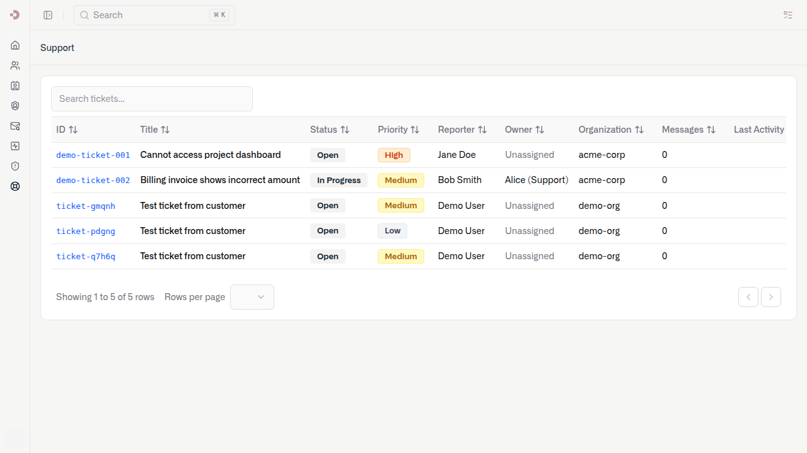
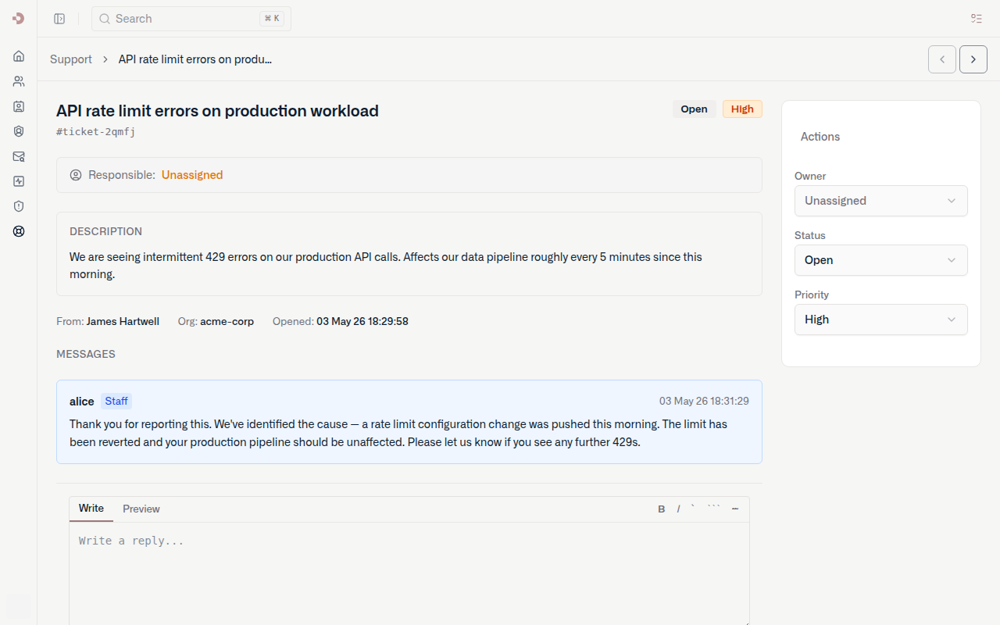
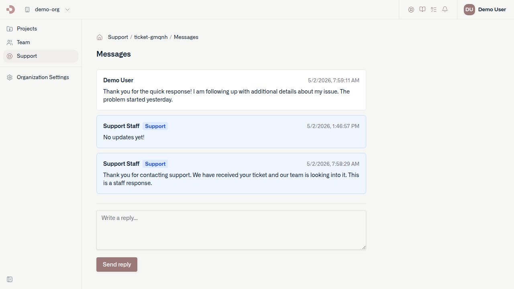
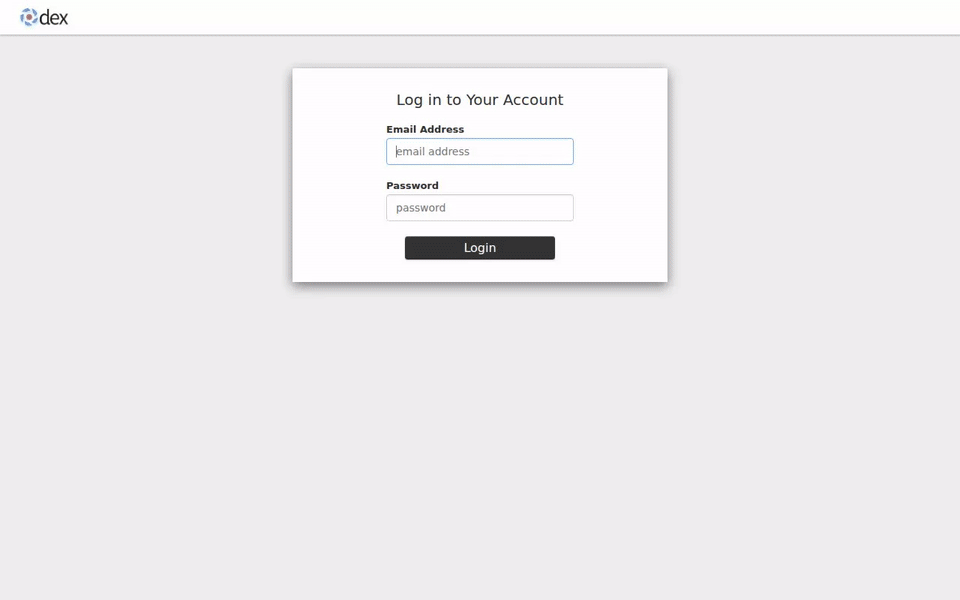

# support

Kubernetes aggregated API server that provides `SupportTicket` and `SupportMessage` resources for the [Datum Cloud](https://github.com/datum-cloud) platform. Tickets and messages are cluster-scoped resources stored in etcd and exposed under the `support.miloapis.com/v1alpha1` API group.

## API resources

| Resource | Kind | Scope | Description |
|----------|------|-------|-------------|
| `supporttickets` | `SupportTicket` | Cluster | A customer support request with title, description, status, priority, and owner |
| `supportmessages` | `SupportMessage` | Cluster | A message or internal note on a ticket |

```sh
kubectl get supporttickets
kubectl get supportmessages
kubectl get supportticket demo-ticket-001 -o yaml
```

## Demo

Run the full local demo with a single command (requires Docker, kind, task):

```sh
task demo:up
```

This starts a kind cluster, deploys Milo, Dex (OIDC), the support API server, both portals, and seeds demo data. See [docs/demo.md](docs/demo.md) for the complete setup guide.

**Demo credentials:** `demo@datum.net` / `password`

### Staff Portal — ticket list (`https://staff.localhost:30443/support`)



### Staff Portal — ticket detail



### Cloud Portal — ticket messages (`https://cloud.localhost:30443`)



### Editing a message

Messages support inline editing with a full markdown editor — hover any message to reveal the edit button.



---

## Development

### Prerequisites

- Go 1.25+
- Docker
- [kind](https://kind.sigs.k8s.io/)
- [task](https://taskfile.dev/)
- cert-manager, Envoy Gateway, and Flux installed in the cluster (handled by `task demo:up`)

Or use the Nix dev shell:

```sh
nix develop   # provides go, go-task, kind, kubectl, k9s, kustomize
```

### Build

```sh
task build          # build the support binary to bin/support
task dev:build      # build the container image
```

### Code generation

Run after changing API types in `pkg/apis/support/v1alpha1/`:

```sh
task generate       # runs deepcopy-gen and openapi-gen
```

### Deploy to a local cluster

```sh
task dev:build        # build image
task dev:load-image   # load into kind
task dev:deploy       # apply kustomize overlay and wait for rollout
```

### Run the full demo

See [docs/demo.md](docs/demo.md) for the complete local demo setup, which includes Milo, Dex (OIDC), the staff portal, and the cloud portal.

```sh
task demo:up    # bring up everything
task demo:down  # tear it all down
```

### Other tasks

```sh
task fmt          # gofmt
task vet          # go vet
task test         # go test ./...
task dev:logs     # stream support API server logs
task dev:status   # show APIService and pod status
task demo:verify  # end-to-end health check
task demo:seed    # create demo tickets and messages
```

## Repository layout

```
cmd/support/              entrypoint
internal/
  apiserver/              server wiring, scheme, codec factory
  registry/
    ticket/               REST storage + strategy for SupportTicket
    message/              REST storage + strategy for SupportMessage
  metrics/                Prometheus metrics registration
  version/                build-time version info
pkg/apis/support/
  v1alpha1/               API types, registration, field label conversions
  install/                scheme installer (registers v1alpha1 + internal hub)
pkg/generated/openapi/    generated OpenAPI definitions
config/
  base/                   Deployment, Service, RBAC, APIService
  components/             cert-manager CA, namespace, API registration
  overlays/dev/           dev kustomize overlay
  demo/auth/              Dex OIDC provider for the local demo
  milo/iam/               Milo IAM roles and resource registration
docs/
  demo.md                 local Kind cluster demo guide
hack/
  kind-config.yaml        Kind cluster config (NodePort 30443)
  boilerplate.go.txt      license header for generated files
```
