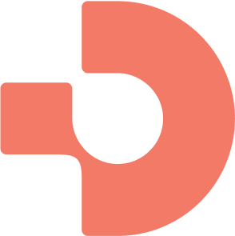

<p align="center">
  
  
  <h1 align="center">Datum Staff Portal</h1>
  
  <p align="center">
    Simplifying cloud operations
  </p>
</p>

## Overview

[](https://app.fossa.com/projects/git%2Bgithub.com%2Fdatum-cloud%2Fstaff-portal?ref=badge_shield)

Datum Staff Portal is a modern web application built with React and TypeScript, designed to streamline cloud operations management. The application uses the latest React Router v7 and is powered by Bun runtime.

## Tech Stack

- **Runtime**: Bun
- **Frontend Framework**: React 19
- **Routing**: React Router 7
- **Styling**: TailwindCSS
- **Type Safety**: TypeScript
- **Build Tool**: Vite
- **Server**: Hono
- **Internationalization**: Lingui

## Project Structure

```bash
staff-portal/
├── app/ # Main application code
│ ├── components/ # Reusable UI components
│ ├── constants/ # Application constants
│ ├── features/ # Feature-specific code
│ ├── hooks/ # Custom React hooks
│ ├── layouts/ # Page layouts
│ ├── modules/ # Third-party library integrations and configurations
│ │ └── i18n/ # Internationalization files
│ ├── providers/ # React context providers
│ ├── routes/ # Application routes
│ ├── server/ # Server-side code
│ ├── styles/ # Global styles
│ └── utils/ # Utility functions
├── cypress/ # Cypress test files
│ ├── e2e/ # End-to-end test files
│ ├── fixtures/ # Test fixtures and mock data
│ ├── support/ # Support files and custom commands
│ └── component/ # Component test files
├── docs/ # Documentation
├── public/ # Static assets
└── .github/ # GitHub configuration
```

## Getting Started

### Prerequisites

- [Bun](https://bun.sh/) (Latest version)

### Installation

1. Clone the repository:

   ```bash
   git clone https://github.com/datum-cloud/staff-portal.git
   cd staff-portal
   ```

2. Install dependencies:
   ```bash
   bun install
   ```

### Development

Start the development server:

```bash
bun run dev
```

### Building

Build the application:

```bash
bun run build
```

### Running Production Build

Start the production server:

```bash
bun run start
```

## Available Scripts

- `bun run dev` - Start development server
- `bun run build` - Build the application
- `bun run start` - Start production server
- `bun run lint` - Run ESLint
- `bun run format` - Format code with Prettier
- `bun run typecheck` - Run TypeScript type checking
- `bun run extract` - Extract messages for translation
- `bun run compile` - Compile translation messages
- `bun run test:e2e` - Run end-to-end tests in CI mode
- `bun run test:e2e:prod` - Run end-to-end tests against production build
- `bun run test:e2e:debug` - Open Cypress Test Runner for E2E tests
- `bun run test:unit:prod` - Run component tests in CI mode
- `bun run test:unit:debug` - Open Cypress Test Runner for component tests

## Testing

The project uses Cypress for both end-to-end (e2e) and component testing:

### Component Testing

- Component tests are written using Cypress Component Testing
- Tests are located in the `cypress/component` directory
- Run component tests in CI mode with `bun run test:unit:prod`
- Open Cypress Test Runner for component tests with `bun run test:unit:debug`

### End-to-End Testing

- E2E tests are written using Cypress
- Tests are located in the `cypress/e2e` directory
- Run E2E tests in CI mode with `bun run test:e2e`
- Run E2E tests against production build with `bun run test:e2e:prod`
- Open Cypress Test Runner for E2E tests with `bun run test:e2e:debug`

## Code Quality

The project uses several tools to maintain code quality:

- ESLint for code linting
- Prettier for code formatting
- TypeScript for type safety
- Lefthook for git hooks

## Contributing

1. Create a new branch for your feature
2. Make your changes
3. Submit a pull request

## License

[](https://app.fossa.com/projects/git%2Bgithub.com%2Fdatum-cloud%2Fstaff-portal?ref=badge_large)
